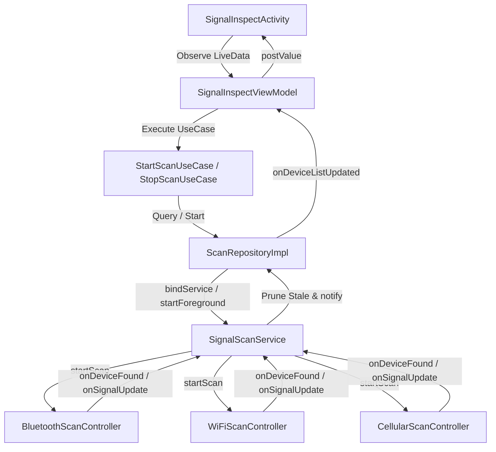

# Smart Signal Detection & Inspection Application — Developer & Agent Handbook

This document provides a comprehensive walkthrough of the application's modular architecture, core logic, data flows, and design patterns. It is designed to help human developers and AI coding agents quickly orient themselves in the codebase, understand key subsystems, and make architectural contributions.

---

## 1. Directory Structure & Architecture

The application is built using a hybrid **Clean Architecture** and **MVVM (Model-View-ViewModel)** pattern, leveraging **Dagger-Hilt** for dependency injection and **Room** for local database management.

```
org.zacsn.signal_dectect/
├── SignalDetectApplication.java       # Custom Application class (Initializes MAC vendor database)
├── MainActivity.java                  # Launcher activity; manages session checks & permissions
├── data/
│   ├── api/                           # Retrofit API configurations and services (Auth, Login, etc.)
│   ├── database/                      # Room Database definition, Entities, DAOs, and Type Converters
│   │   ├── AppDatabase.java           # DB definition (Scan records, blacklist, whitelist, watchlist)
│   │   ├── Converters.java            # Room converters (JSON string serialization for device lists)
│   │   └── ...Dao.java / ...Entity.java
│   │
│   ├── repository/                    # Data access coordination
│   │   ├── DeviceRepository.java      # Interface / Impl for handling list management
│   │   └── ScanRepository.java        # Interface / Impl (coordinates Foreground Scan Service binding)
│   │
│   └── scanner/                       # Hardware abstraction & active scanners
│       ├── BluetoothScanController.java      # BLE scanner & Classic BT discovery + GATT probing
│       ├── WiFiScanController.java           # WiFi BSSID/SSID scanner + OUI lookup
│       ├── CellularScanController.java       # Cellular network towers monitor (CellInfo & Telephony)
│       ├── ExternalRadioAdapterManager.java  # External antenna/interface mapping coordinator
│       ├── ScanSourceSelection.java          # Handles fallback configurations
│       └── SignalDeviceStabilizer.java       # Rolling average calculations to smooth RSSI values
│
├── domain/                            # Business rules / Use Cases (pure Java/Kotlin logic)
│   ├── alert/                         # Threat match algorithms (OUI, Brand, Keyword matching)
│   │   ├── AlertConfig.java           # Alert criteria container (Whitelist, Blacklist, Watchlist)
│   │   └── AlertRuleMatcher.java      # Rule evaluation engine
│   ├── model/                         # Domain Models (SignalDevice, LanDevice, DeviceType, etc.)
│   └── usecase/                       # Interactors (StartScanUseCase, StopScanUseCase, ListUseCases)
│
├── service/                           # Android Services
│   └── SignalScanService.java         # Foreground Service for continuous scanning & stale pruning
│
├── presentation/                      # UI Components
│   ├── activity/                      # Activities (Detail Views, Login, Password Changes, LAN scanning)
│   ├── adapter/                       # RecyclerView Adapters (Signal Devices, LAN Devices, Logs)
│   ├── fragment/                      # Main screen tabs (Home, Records, Profile)
│   └── viewmodel/                     # ViewModels implementing LiveData bindings
│
└── util/                              # Shared utility classes
    ├── AudioDiagnostics.java          # Diagnostic tools for testing speaker hardware
    ├── BluetoothManufacturerUtils.java# BLE Company ID & USB Vendor ID lookup
    ├── DistanceUtils.java             # RSSI path-loss distance conversions
    ├── MacVendorUtils.java            # OUI manufacturer resolver (reads assets/oui.csv)
    ├── MachineCodeUtils.java          # SHA-256 unique hardware device fingerprint generator
    ├── PermissionManager.java         # API level-based runtime permissions checker
    ├── SoundEffectManager.java        # MediaPlayer controls (sweep sounds & alarm buzzers)
    └── SessionManager.java            # SharedPreferences security & licensing states
```

---

## 2. Core Functional Subsystems

### 2.1 Authentication, Licensing & Session Management
- **Deterministic Machine Fingerprinting**: [MachineCodeUtils](file:///data/desktop/projects/signal_dectect/app/src/main/java/org/zacsn/signal_dectect/util/MachineCodeUtils.java) generates a deterministic machine code prefixed with `MC-` by digesting the package name and `Settings.Secure.ANDROID_ID` using SHA-256. If ANDROID_ID is corrupted or unavailable (e.g., `9774d56d682e549c`), a UUID fallback is created and saved.
- **REST Backend Authentication**: [AuthApiService](file:///data/desktop/projects/signal_dectect/app/src/main/java/org/zacsn/signal_dectect/data/api/AuthApiService.java) makes calls to the server endpoint `http://47.82.157.64:1234/` for `/api/auth/login`, `/api/auth/me`, and `/api/auth/change-password`.
- **Offline / Local Session Sync**: [SessionManager](file:///data/desktop/projects/signal_dectect/app/src/main/java/org/zacsn/signal_dectect/util/SessionManager.java) stores user credentials, JWT tokens, bound machine codes, and licensing duration (`validUntil`). During startup, [MainActivity](file:///data/desktop/projects/signal_dectect/app/src/main/java/org/zacsn/signal_dectect/MainActivity.java) sends the cached token to the `/api/auth/me` endpoint to validate license status. If the network call fails, the app falls back to local SharedPreferences state to allow offline functionality.

### 2.2 Wireless Signal Scanning Infrastructure
Scanning is driven by a bounded Android Foreground Service linked to the UI through a repository binder.



#### 2.2.1 continuous Foreground Service ([SignalScanService](file:///data/desktop/projects/signal_dectect/app/src/main/java/org/zacsn/signal_dectect/service/SignalScanService.java))
- runs as a foreground service with `foregroundServiceType="location"`.
- Updates a persistent system notification displaying the count of discovered signals.
- **Stale Device Pruner**: Since wireless devices move out of range, a handler task runs every **1.0 second** (`STALE_PRUNE_INTERVAL_MS`) to clear stale devices. If a device has not been refreshed within its corresponding type timeout, it is removed:
  - Low Energy Bluetooth (BLE): **20 seconds**
  - Classic Bluetooth (BT): **18 seconds**
  - WiFi AP: **25 seconds**
  - Cellular Cell Tower: **30 seconds**

#### 2.2.2 Bluetooth Scanning & Active Probing ([BluetoothScanController](file:///data/desktop/projects/signal_dectect/app/src/main/java/org/zacsn/signal_dectect/data/scanner/BluetoothScanController.java))
- **Dual Mode Scan**:
  - BLE: Uses Android's `BluetoothLeScanner` with `SCAN_MODE_LOW_LATENCY` for real-time discoveries.
  - Classic BT: Registers a broadcast receiver listening to `BluetoothDevice.ACTION_FOUND` and triggers `BluetoothAdapter.startDiscovery()`, looping it continuously.
- **Active GATT Probing**: When a BLE device is discovered within a near range (RSSI > -90 dBm), it is queued to an active connection worker pool (maximum 4 concurrent connections). The controller connects to the device, queries the GATT services, and reads:
  - Device Name (GAP Service `0x2A00`)
  - Manufacturer Name (Device Info Service `0x2A29`)
  - Model Number (Device Info Service `0x2A24`)
  - PnP ID (Device Info Service `0x2A50`)
  This data is merged to form a reliable manufacturer verdict (`ManufacturerVerdict.CONFIRMED`), bypassing local MAC spoofing.
- **Apple Privacy Address Aliasing**: Apple devices randomize their BLE MAC address. To prevent a single physical device from cluttering the UI as 50 different MAC addresses, the controller matches localized random addresses (MACs with the locally-administered bit set) using a **20-second time window** and a **12 dBm signal difference window**. If they match nearby Apple Nearby / FindMy signatures, they are merged into a single device entity in the UI list.

#### 2.2.3 WiFi Scanning ([WiFiScanController](file:///data/desktop/projects/signal_dectect/app/src/main/java/org/zacsn/signal_dectect/data/scanner/WiFiScanController.java))
- Triggers periodic scans every **10 seconds** (`WIFI_SCAN_INTERVAL_MS`) via `WifiManager.startScan()` and registers a broadcast receiver for `SCAN_RESULTS_AVAILABLE_ACTION`.
- **Throttle Mitigation**: Android limits WiFi scans to 4 times per 2-minute window. If the OS throttles active scanning, the controller traps the error, issues a non-blocking UI toast, and falls back to listing the last cached result snapshot.
- **Resolution Strategy**: Uses OUI prefixes extracted from BSSIDs looked up against `oui.csv` (initialized on startup in `MacVendorUtils`) and SSID regex patterns (inferring brands like Apple, Huawei, Xiaomi, etc.).

#### 2.2.4 Cellular network Scanning ([CellularScanController](file:///data/desktop/projects/signal_dectect/app/src/main/java/org/zacsn/signal_dectect/data/scanner/CellularScanController.java))
- Monitors cellular signals by hooking into `TelephonyManager`.
- On Android 12+, it registers a `TelephonyCallback` with `SignalStrengthsListener`. On older versions, it falls back to `PhoneStateListener`.
- It reads local surrounding cells using `telephonyManager.getAllCellInfo()` and parses:
  - LTE (4G): MCC/MNC (PLMN), TAC, Cell ID, PCI, EARFCN, signal strength (dBm).
  - NR (5G): MCC/MNC, TAC, NCI, PCI, NRARFCN, signal strength (dBm).
  - WCDMA (3G), GSM (2G), CDMA.
- Distinguishes between the registered serving cell tower (active carrier channel) and neighboring towers. If cell details are blocked by system permissions, it falls back to reporting the network operator name and cellular signal level.

#### 2.2.5 Signal Stabilization & Distance Model
- **RSSI Smoothing**: RSSI values fluctuate due to environmental interference. [SignalDeviceStabilizer](file:///data/desktop/projects/signal_dectect/app/src/main/java/org/zacsn/signal_dectect/data/scanner/SignalDeviceStabilizer.java) smooths signal changes by averaging new RSSI inputs with historical data using a localized decay curve.
- **Distance Calculation**:
  - Bluetooth: Calculated using the Log-Distance Path Loss model:
    $$d = 10^{\frac{P_{tx} - RSSI}{10 \cdot n}}$$
    where $P_{tx}$ is normalized TxPower (defaulting to -59 dBm) and $n$ (path-loss exponent) is configured at 2.5.
  - WiFi: Derived using the Free-Space Path Loss equation based on RSSI and frequency.
  All calculated distances are validated and capped at 100 meters using [DistanceUtils](file:///data/desktop/projects/signal_dectect/app/src/main/java/org/zacsn/signal_dectect/util/DistanceUtils.java).

### 2.3 LAN Device Scanning ([LanScanViewModel](file:///data/desktop/projects/signal_dectect/app/src/main/java/org/zacsn/signal_dectect/presentation/viewmodel/LanScanViewModel.java))
LAN scanning runs on a dedicated subnet worker:
1. **Subnet Lookup**: Queries the local gateway IP and subnet mask via `WifiManager` or network interfaces.
2. **ARP Warm-Up**: Reads `/proc/net/arp` to load cached MAC addresses, displaying known local devices immediately in the UI.
3. **Multithreaded Active Sweep**: Spawns an executor thread pool of **32 threads** to ping the subnet range from `.1` to `.254`.
4. **IP Pinging & Hostname Resolution**: Calls `address.isReachable(600)` (ICMP ping) and runs `exec("ping -c 1 -W 1 ip")` in bash to force update the OS kernel's ARP table. Resolves hostnames via `InetAddress.getByName(ip).getCanonicalHostName()`.
5. **Device Classification**: Matches manufacturer name and hostname against keyword patterns to categorize devices:
   - Gateway/Router (matches gateway IP)
   - Camera (matches keywords: `camera`, `ipc`, `hikvision`, `dahua`, `ezviz`)
   - Network Equipment, Mobile Terminal, PC/Laptop, or Unknown.
6. **Sorting**: Gateway devices are sorted first, followed by other devices sorted by the last octet of their IP address.

### 2.4 Alert Matching Logic ([AlertRuleMatcher](file:///data/desktop/projects/signal_dectect/app/src/main/java/org/zacsn/signal_dectect/domain/alert/AlertRuleMatcher.java))
The application alerts users to threats based on three lists maintained in the Room database:
- **Whitelist**: Discovered MAC addresses matching this list are ignored (no alerts are triggered).
- **Blacklist**: Discovered MAC addresses matching this list trigger a `"黑名单告警"` ("Blacklist Alert").
- **Watchlist**: Discovered devices whose MAC, brand (e.g. apple, huawei), or name keywords match this list trigger a `"巡检机型告警"` ("Watchlist Alert").
- **Alert Trigger Flow**: When an alert matches during scanning:
  1. The device is highlighted in red in [SignalInspectActivity](file:///data/desktop/projects/signal_dectect/app/src/main/java/org/zacsn/signal_dectect/presentation/activity/SignalInspectActivity.java).
  2. The background sweep sound is switched from `R.raw.normal_scan` to `R.raw.apple_alert` via [SoundEffectManager](file:///data/desktop/projects/signal_dectect/app/src/main/java/org/zacsn/signal_dectect/util/SoundEffectManager.java) (using MediaPlayer with audio focus).
  3. A custom warning modal is displayed. Dismissing or viewing the device detail restores the normal scanning audio.

---

## 3. Database Schema

The database is built on **Room** (`signal_detect_db`), configured in [AppDatabase](file:///data/desktop/projects/signal_dectect/app/src/main/java/org/zacsn/signal_dectect/data/database/AppDatabase.java):

| Table / Entity | Primary Key | Key Fields | Description |
| :--- | :--- | :--- | :--- |
| `ScanRecordEntity` | `id` (auto-gen) | `timestamp` (long)<br>`scanType` (int)<br>`duration` (long)<br>`deviceCount` (int)<br>`devicesJson` (TEXT) | Historical scanning logs. Discovered devices list is serialized to JSON string via Room TypeConverters. |
| `WatchlistItemEntity` | `macAddress` | `deviceName` (String)<br>`matchType` (MAC / BRAND / KEYWORD)<br>`matchValue` (String)<br>`timestamp` (long) | Targets configured by the user (or selected via presets in `DeviceModelActivity`) to alert on. |
| `BlacklistItemEntity` | `macAddress` | `deviceName` (String)<br>`deviceType` (String)<br>`reason` (String)<br>`timestamp` (long) | Suspicious MAC addresses to trigger alerts. |
| `WhitelistItemEntity` | `macAddress` | `deviceName` (String)<br>`deviceType` (String)<br>`timestamp` (long) | Trusted MAC addresses to filter out from alarms. |

---

## 4. Key Agent Workflows & Extension Guides

### 4.1 How to Add a New Scan Protocol
1. **Define Device Type**: Extend `DeviceType` enum in `domain/model` if required.
2. **Implement Scan Controller**: Create a controller under `data/scanner/`. Implement `startScan()`, `stopScan()`, and set up callbacks.
3. **Register in Service**: Inject the new controller in `SignalScanService.java`. Update `startScan(ScanType)` and `stopScan()` to trigger it, and update `isDeviceMatchingScanType()` to map your new device category.
4. **Update UI & ViewModels**: Add filtering support in `SignalInspectViewModel.java` and bind layout items in `SignalInspectActivity.java`.

### 4.2 How to Customize or Debug Alert Audio
1. **Locate Sound Classes**: Check [SoundEffectManager.java](file:///data/desktop/projects/signal_dectect/app/src/main/java/org/zacsn/signal_dectect/util/SoundEffectManager.java).
2. **Audio Diagnostics**: Run [AudioDiagnostics.java](file:///data/desktop/projects/signal_dectect/app/src/main/java/org/zacsn/signal_dectect/util/AudioDiagnostics.java) to test device output paths. Long-pressing the title bar in `SignalInspectActivity` runs a sound test via `SoundTestHelper` to verify volume configuration and audio focus behavior.
3. **Replace Audio Assets**: Put new audio files (`.wav` or `.mp3`) into `app/src/main/res/raw/` named `normal_scan` or `apple_alert`.

### 4.3 Database Migrations
- App database version is currently `3`.
- If modifying entities (e.g. `ScanRecordEntity`), make sure to increment the version in `AppDatabase.java` and declare a migration block, or rebuild/wipe local testing storage if running during development.
