# 智能信号感知系统 App 用户说明书

本文档基于实际手机页面截图编写，用于帮助用户快速了解 App 的功能、页面入口和日常使用方法。

> 说明：无线扫描结果会受手机权限、Android 系统限制、现场信号环境、目标设备广播策略影响。BLE 广播中的厂商线索不等于真实设备厂商，App 会尽量采用保守策略减少误报。

## 1. 首页

登录成功后进入首页。首页提供四类巡检入口，并展示历史记录、白名单数量和风险概览。

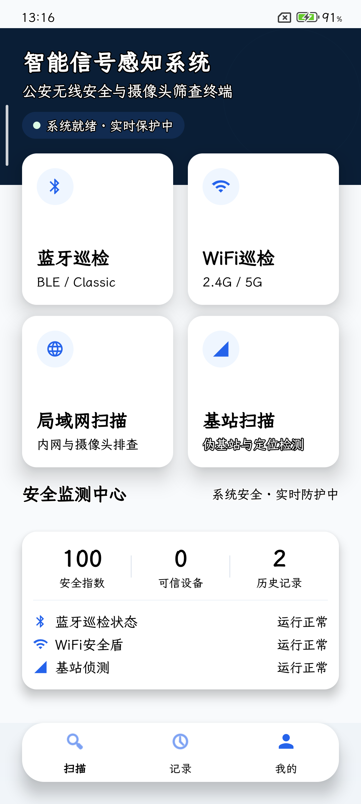

首页主要入口：

- 蓝牙巡检：扫描经典蓝牙和 BLE 设备。
- WiFi 巡检：扫描周边 WiFi 热点。
- 局域网扫描：扫描当前网络中的可达设备。
- 基站扫描：查看蜂窝网络相关信号信息。
- 底部导航：可在“扫描”“记录”“我的”之间切换。

## 2. 开始蓝牙巡检

在首页点击“蓝牙巡检”，进入巡检页面。页面中间是雷达扫描区域，下方蓝色按钮用于开始或停止巡检。

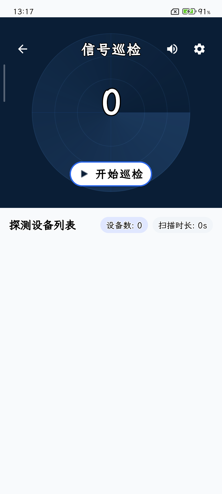

操作步骤：

1. 点击“开始巡检”。
2. 等待扫描结果刷新。
3. 需要结束时点击“停止巡检”。
4. 返回上一页时，可选择是否保存本次扫描记录。

扫描过程中，设备列表会显示设备名称、地址、信号强度、估计距离和识别信息。

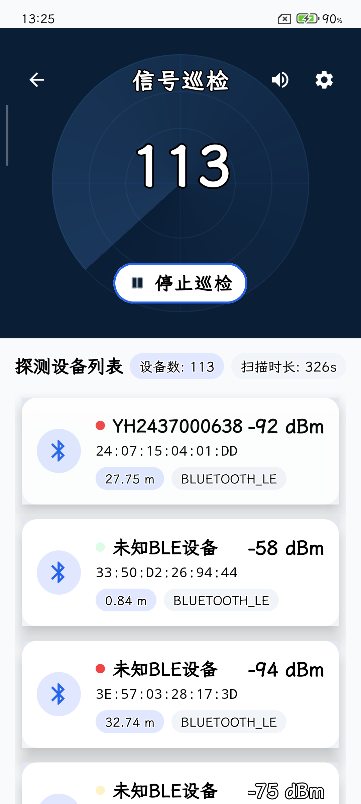

## 3. 告警处理

当扫描到符合告警规则的设备时，App 会弹出告警窗口。窗口会展示设备名称、类型、MAC 地址、厂商、信号强度和距离等信息。

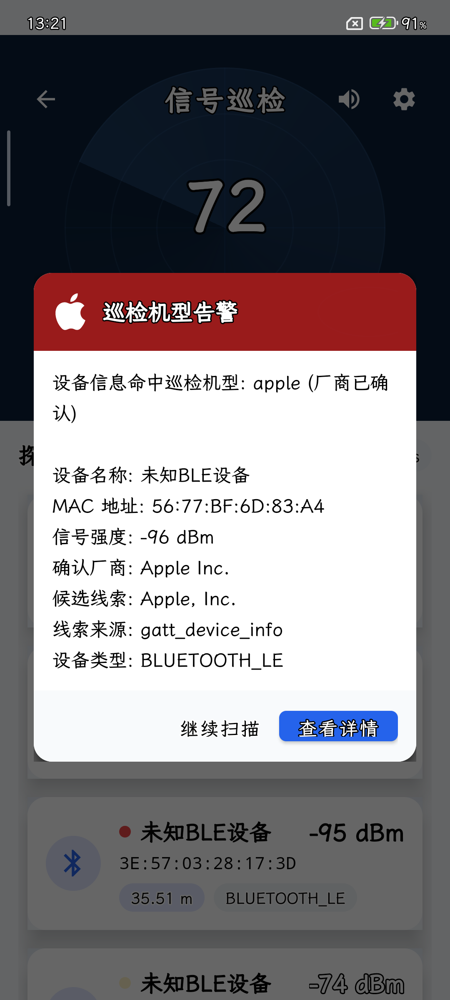

告警窗口按钮：

- 继续扫描：关闭当前告警并继续扫描。如果现场连续发现多个符合规则的设备，关闭后可能马上出现新的告警。
- 停止扫描：结束当前巡检。

当前告警逻辑以减少误报为优先：

- MAC 地址精确命中黑名单时，会告警。
- 设备厂商被可靠确认，并命中“信号巡检机型”配置时，会告警。
- 仅 BLE Company ID、设备名、MAC OUI 或 iBeacon 格式显示 Apple 线索时，不应直接认定为 Apple 设备。

## 4. 保存巡检记录

停止巡检或返回上一页时，如果本次扫描发现了设备，App 会询问是否保存记录。

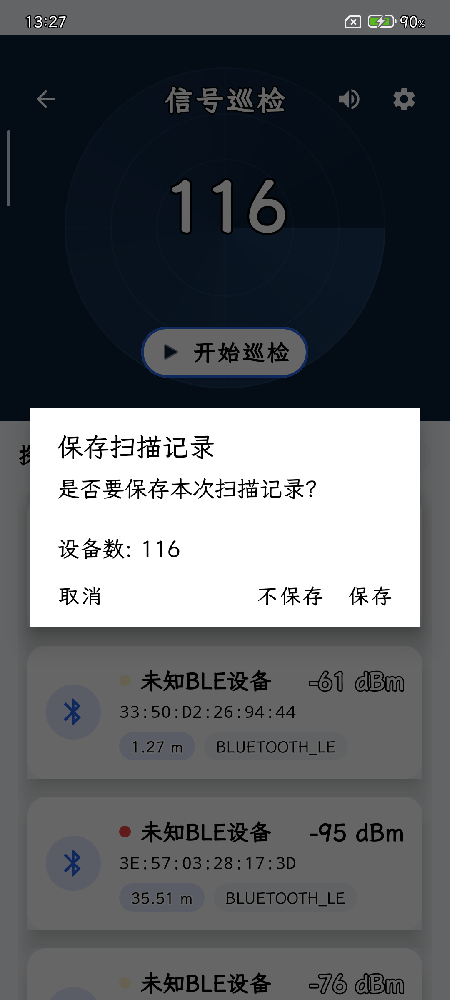

可选操作：

- 保存：保存本次扫描结果，之后可在“记录”页查看。
- 不保存：放弃本次结果并返回。
- 取消：留在当前扫描页面。

## 5. 历史记录

点击底部“记录”进入历史记录页。这里用于查看、搜索和管理已保存的巡检记录。

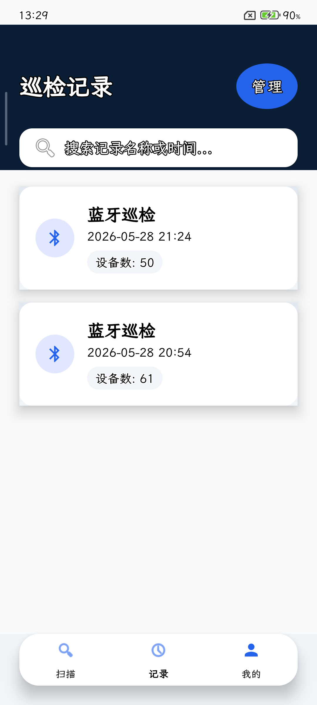

常用操作：

- 查看某次巡检记录中的设备列表。
- 搜索记录名称或时间。
- 重命名记录。
- 删除单条或批量删除记录。

## 6. 我的页面

点击底部“我的”进入个人中心。这里集中管理巡检机型、白名单、黑名单、授权信息和密码。

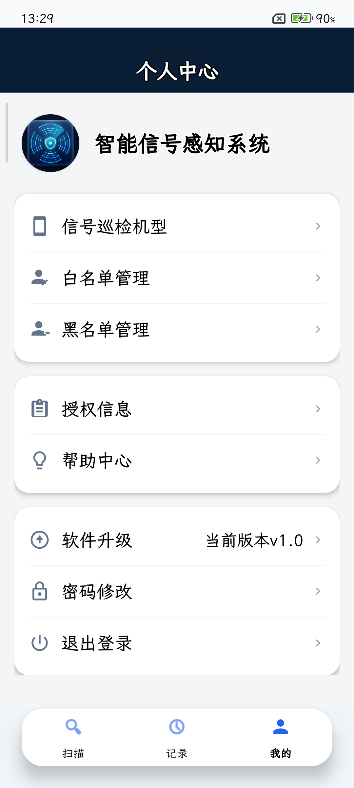

### 6.1 信号巡检机型

进入“信号巡检机型”后，可以勾选需要重点关注的设备厂商。

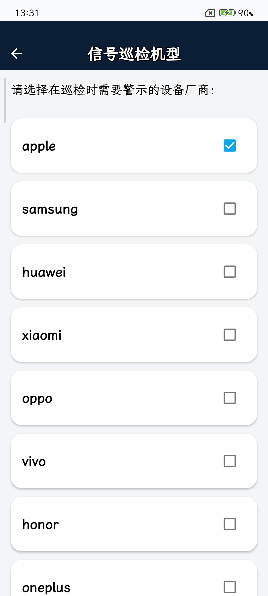

使用建议：

- 勾选后，App 会把该厂商作为重点巡检对象。
- 对 BLE 设备，只有厂商被可靠确认后才应作为高可信告警依据。
- 不建议只因为扫描列表里出现 Apple Inc、Samsung 等候选线索，就直接判断设备归属。

### 6.2 白名单管理

白名单用于登记可信设备。命中白名单的设备可用于降低或排除告警干扰。

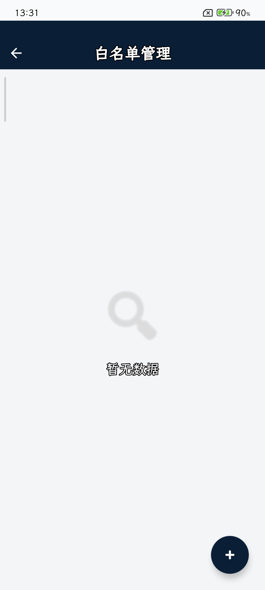

操作方式：

- 点击右下角“+”添加设备。
- 建议填写明确的 MAC 地址或可稳定识别的设备信息。
- 适合登记现场已知、安全、可信的设备。

### 6.3 黑名单管理

黑名单用于登记需要重点警示的设备。

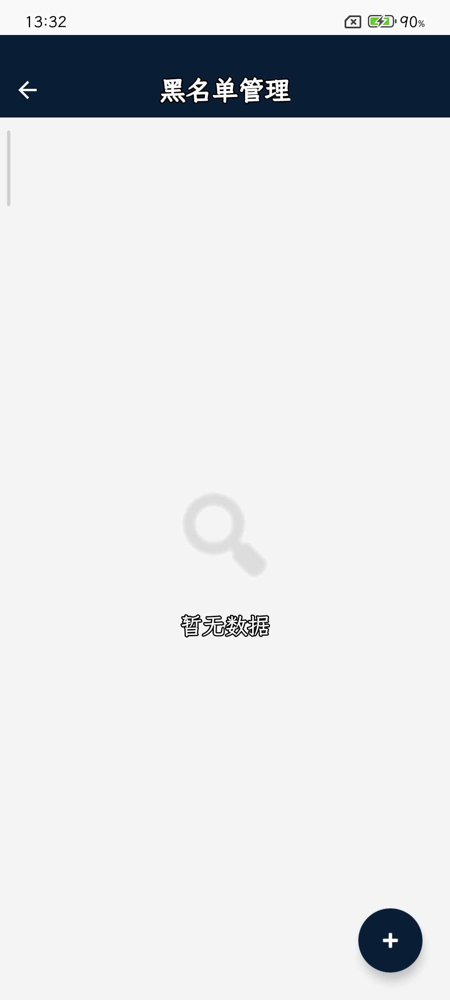

操作方式：

- 点击右下角“+”添加设备。
- 推荐优先添加明确 MAC 地址。
- 扫描时如果精确命中黑名单设备，会触发告警。

### 6.4 授权信息

“授权信息”页展示当前账号或设备的授权状态、授权序列号和有效期。

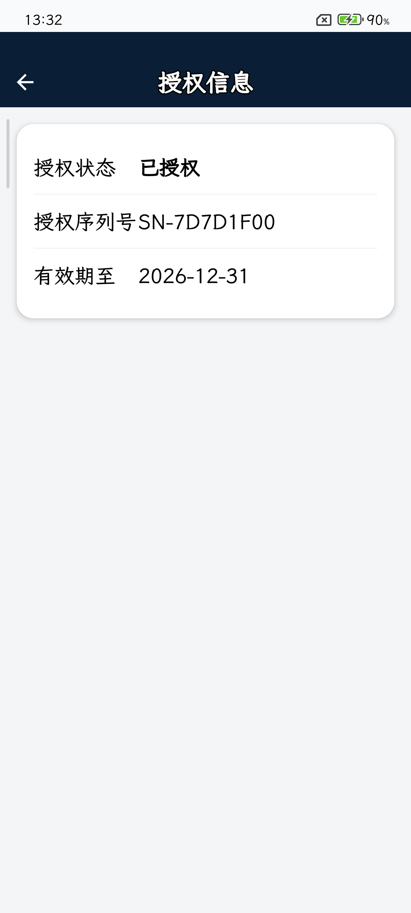

如果授权过期，请联系管理员在服务端更新授权日期，然后重新登录或刷新授权状态。

### 6.5 修改密码

进入“密码修改”页后，依次输入当前密码、新密码、确认新密码，然后点击“提交修改”。

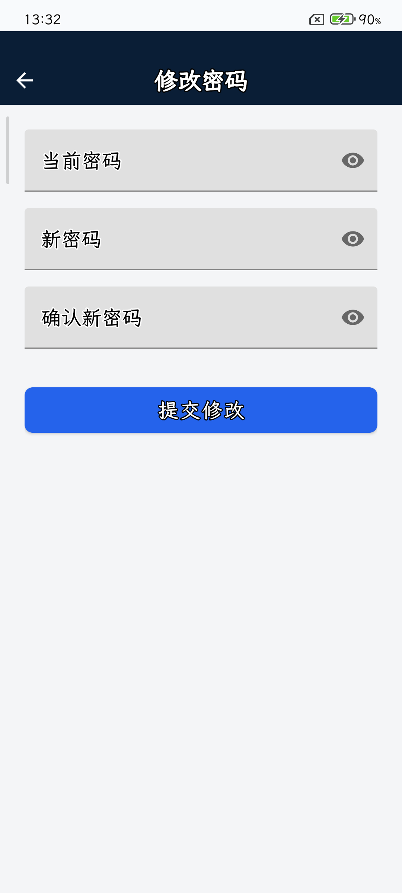

注意事项：

- 新密码和确认新密码必须一致。
- 修改成功后通常需要使用新密码重新登录。
- 如果提示连接失败，请确认手机可以访问服务器 IP 和端口，后端服务已启动，服务器防火墙已放行端口。

## 7. BLE 厂商识别说明

很多 BLE 设备会在广播里带有 Company ID。例如 Apple 的 Company ID 可能出现在 iBeacon 等协议数据中，但这不等于设备本身一定是 Apple 产品。第三方设备也可能使用 Apple 相关广播格式。

因此，判断设备所属厂商时应区分：

- 已确认厂商：通过更可靠的信息源确认，例如可读取到标准 GATT 设备信息中的 Manufacturer Name。
- 候选厂商：来自 BLE Company ID、设备名、MAC OUI、广播格式等被动线索。
- 未确认：没有足够信息确认真实厂商。

使用建议：

- 以黑名单的精确 MAC 命中作为最高可信告警依据。
- 对厂商类告警，结合“信号巡检机型”配置和确认厂商结果使用。
- 对同一现场多次扫描，结合时间、位置、信号强弱变化综合判断。

## 8. 常见问题

### 为什么点“继续扫描”后又弹出告警？

“继续扫描”会关闭当前这一次告警。如果周围还有其它符合规则的设备，或同一设备再次被扫描流程确认，可能会立刻弹出新的告警。

### 为什么扫描列表里出现 Apple Inc，但不能直接认为是苹果设备？

BLE 广播中的 Apple Inc 很多时候只是协议或广播字段线索，不一定代表设备真实厂商。需要结合可确认厂商、黑名单、设备名、地址稳定性和现场环境判断。

### 为什么扫描不到某些设备？

常见原因包括：目标设备未广播、使用随机地址、信号太弱、距离太远、Android 限制扫描频率、缺少蓝牙或定位权限、设备只允许配对后读取详细信息。

### 修改密码失败怎么办？

请检查：

- 手机网络是否能访问服务器。
- 后端 Node 服务是否正在运行。
- 服务器端口是否已放行。
- 当前密码是否正确。
- 账号授权是否仍有效。

## 9. 日常使用流程建议

1. 先到“我的 > 信号巡检机型”勾选需要重点关注的厂商。
2. 将已知可信设备加入白名单。
3. 将明确风险设备的 MAC 地址加入黑名单。
4. 回到首页进入蓝牙、WiFi、局域网或基站巡检。
5. 发现告警后查看详情，必要时继续扫描确认。
6. 巡检结束后保存记录，后续在“记录”页复查。
